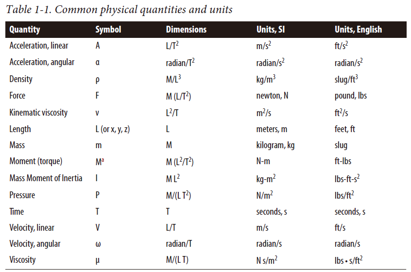
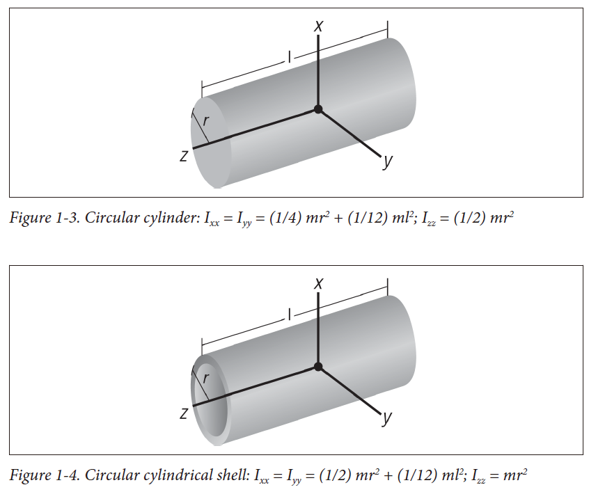
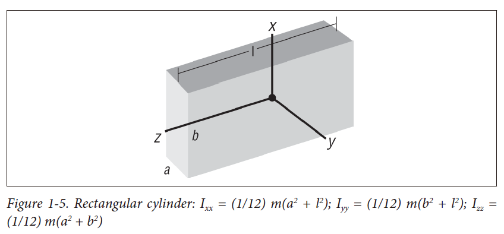
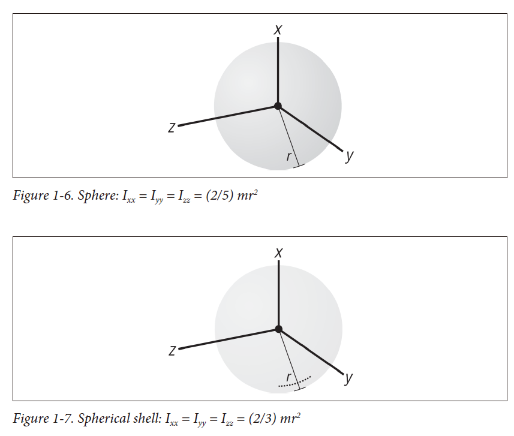

- [Basic Concepts](#basic-concepts)
  - [Units and Measures](#units-and-measures)
  - [Mass, Cneter of Mass, and Moment of Inertia](#mass-cneter-of-mass-and-moment-of-inertia)
    - [Calculate each properties](#calculate-each-properties)
    - [Codes](#codes)
    - [parrallel axis theorem](#parrallel-axis-theorem)
    - [Simple geometries mass moments of inertia about the neutral axis](#simple-geometries-mass-moments-of-inertia-about-the-neutral-axis)

# Basic Concepts

## Units and Measures

## Mass, Cneter of Mass, and Moment of Inertia

- mass, mass as a measure of a body's resistance to motion or a change in its motion.
- center of mass, the point through which any force can act on the body without resulting in a rotation of the body.
- moment of inertia(rotational inertia), the mass moment of inertia of a body is a quatitative measure of the radial distribution of the mass of a body about a given axis of rotation, is a measure of a body's resistance to rotational motion.

### Calculate each properties

- mass, $m = \int \rho \space dV = \rho \int dV$, or simply sum the masses of all components to arrive at the total mass.
- center of mass
$$
x_c = \{\sum x_o \space m_i\} / \{\sum m_i\} \\
y_c = \{\sum y_o \space m_i\} / \{\sum m_i\} \\
x_c = \{\sum z_o \space m_i\} / \{\sum m_i\}
$$
total mass and center of gravity for a system
$$
m_t = \sum m_i \\
CG = [\sum (cg_i)(m_i)] / m_t
$$
$cg_i$ is the location of the center of gravity of each point mass in reference coordinates.

### Codes

[mass_calculator.py](./Scripts/mass_calculator.py)

### parrallel axis theorem

$$I = I_o + md^2$$

where m is the mass of the body and d is the perpendicular distance between the parallel axes. $I_o$ the moment of inertia of a body about the neutral axis.

### Simple geometries mass moments of inertia about the neutral axis

##