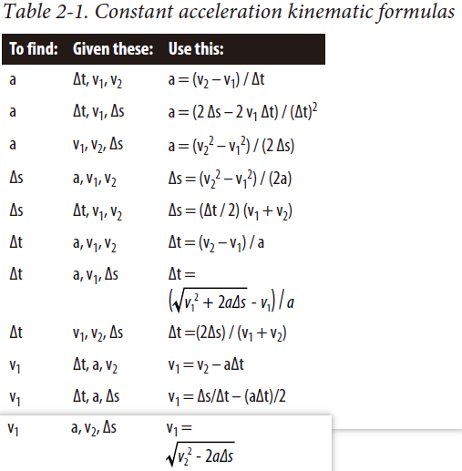

# Kinematics

## Velocity and Acceleration

when $\Delta{t}$ is very small displacement and distance traveled are the same. otherwisem displacement means difference between the starting position coordinates and the ending position coordinates.

$$v = ds/dt$$
$$a = dv/dt = d^2s/dt^2$$
$$v \space dv = a \space ds$$

## Constant Acceleration

$$v_2 = v_1 + a \space t_2$$
$${v_2}^2 = 2a(s_2 - s_1) + {v_1}^2$$
$$s_2 = s_1 + v_1 t + (a t^2) /2$$



## Nonconstant Acceleration


$s = \ln{(1 + v_1 k t)} / k$ while $a = -k v^2$

## 3D Particle Kinematics

[Particle Kinematics Example](./Scripts/ParticleKinematics.cpp)

## Kinematic Particle Explosion

[Particle Explosion Example](./Scripts/ParticleExplosion.cpp)

## About run example

```shell
cd C02_Kinematics/Scripts/
cmake .
cmake --build .
./Debug/ParticleKinematics.exe
```