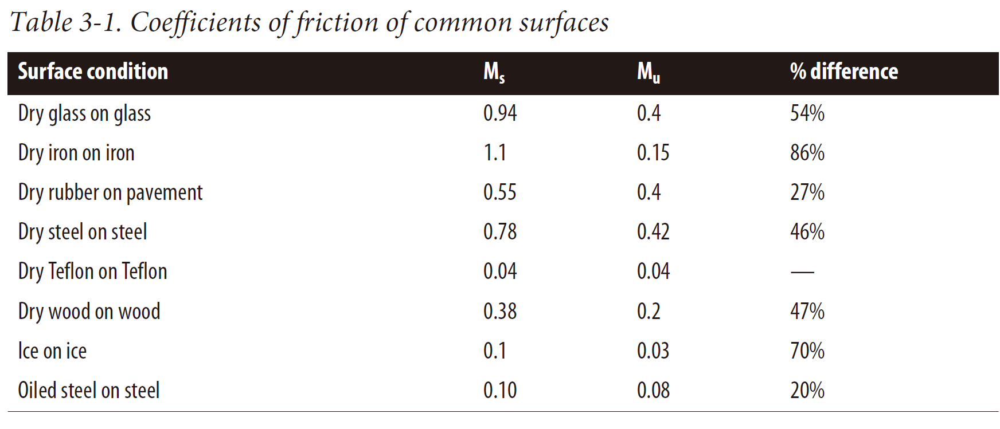

- [Force](#force)
  - [Force Fields](#force-fields)
  - [Friction](#friction)
  - [Fluid Dynamic Drag](#fluid-dynamic-drag)
  - [Pressure](#pressure)
  - [Buoyancy](#buoyancy)
  - [Springs and Dampers](#springs-and-dampers)
  - [Force and Torque](#force-and-torque)

# Force

## Force Fields

$$F_a = (G m_1 m_2) / r^2$$

$$a = g = (G M_e) / (R_e + h)^2$$

$M_e$ means mass of earth is about $5.98 \times 10^{24}$kgs, $R_e$ means radius of the earth is approximately $6.38 \times 10^6$m

## Friction

$$F_{fmax} = \mu_sN$$

$$F_{fk}=\mu_kN$$

here $\mu_s$ and $\mu_k$ means friction in static and kenetic.typical coefficients of friction for several surfaces in contact determined experimentally show in the table.

## Fluid Dynamic Drag

$$F_v = -C_fv$$

$$F_v = -C_f v^2$$

The second formula used in "Fast moving" that the flow around the object is tubulent.Note that the values of $C_f$ are generally not the same for these two equations.

## Pressure

$$F=PA$$

A means the total area acted on by this pressure

## Buoyancy

$$F_B = (\rho g)(s^3)$$

$s^3$ means the volume of the object

## Springs and Dampers

$$F_s = k_s(L -r)$$

$F_s$ is the spring force, $k_s$ is the spring constant, L is the stretched or compressed length of the spring, and r is the rest length of the spring.

$$F_d = k_d(v_1 - v_2)$$

$$F_1 = -\{k_s(L-r )+k_d((\bold{v_1}-\bold{v_2})\cdot \bold{L}/ L\}\bold{L}/L$$

## Force and Torque

$$\bold{M} = \bold{r} \times \bold{F}$$