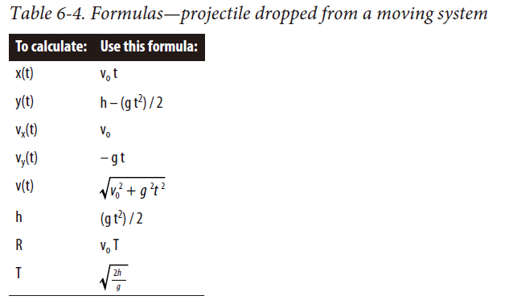

- [Projectiles](#projectiles)
  - [Simple Trajectories](#simple-trajectories)
  - [Drag](#drag)
  - [Magnus Effect](#magnus-effect)

# Projectiles

when designing and optimizing your code, you’ll know where to cut things out without sacrificing realism. This gets into the subject of parameter tuning.

## Simple Trajectories

## Drag

Bernoulli’s equation.

all other things being equal, a slightly roughened sphere will have less total drag than a smooth one.

Given the total drag coefficient($C_d$), you can estimate the total resistance (drag) using the following formula: 

$$R_t = (0.5 \rho v^2 A ) C_d$$

drag will limit the maximum vertical velocity attainable. This limit is the so-called terminal velocity. you can derive the following formula for terminal velocity for an object in free fall:

$$v_t = \sqrt{\frac{2mg}{C_d \rho A}}$$

## Magnus Effect

